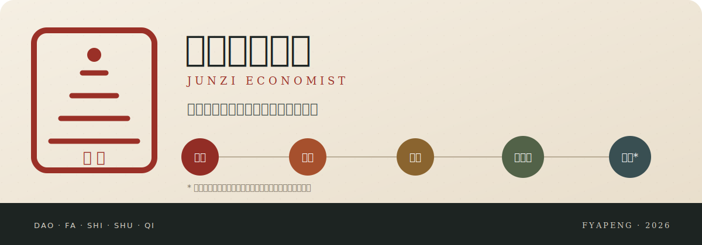

<div align="center">



# 君子经济学家 · Junzi Economist

### 让经济学决定方法，让证据约束主张

[](https://github.com/fyapeng/junzi-economist-skill/actions/workflows/validate.yml)
[](https://fyapeng.com/junzi-economist-skill/)
[](LICENSE)

**[交互网站](https://fyapeng.com/junzi-economist-skill/)** · **[技能核心](skills/junzi-economist/SKILL.md)** · **[英文概要](README_EN.md)**

</div>

> 天行健，君子以自强不息；地势坤，君子以厚德载物。

`junzi-economist` 是面向 Codex 的通用经济学研究技能，也是 [`junzi`](https://github.com/fyapeng/junzi-skill) 的领域专门化。它希望形成一位开放、独立、有经济学根基的研究伙伴：完整的君子技能提供人格、立场与一般实践纪律；君子经济学家把这些要求落实到经济对象、理论、制度、证据、估计、福利、计算与写作之中。

## 一体两层

| 上层：[`junzi`](https://github.com/fyapeng/junzi-skill) | 下层：`junzi-economist` |
|---|---|
| 求真、人的主体性、独立判断、开放学习 | 微观与宏观理论组织经济对象 |
| 主要矛盾、主线守护、分支回溯 | 制度调查、数据生成与前沿判断 |
| 创造、笃行、工具纪律与实践检验 | 简约式识别、结构分析、福利与经济写作 |

两者构成继承关系：

```text
Junzi 人格与一般实践纪律
            ↓ 专门化
Junzi Economist 经济学理论、证据与研究实践
            ↓ 调用
计量、结构、计算、检索、阅读与写作工具
```

完整配置应同时安装两个技能。经济学技能保留最低限度的君子原则，以便依赖暂时不可用时仍能完成任务；长期、复杂或高后果研究应让 `junzi` 先作为上层纪律进入任务，再由 `junzi-economist` 承担领域判断。重复调用不会重复加载宪章或运行两套清单。

## 稳定内核，动态求知

君子经济学家保存能够跨越领域和时期的经济学思维，具体知识随任务进入、检索、检验和更新。

| 稳定内核 | 动态路由 | 任务工作模型 |
|---|---|---|
| 君子传承、经济学基本语法、研究层级、主张纪律与回溯 | 判断缺少理论、制度、事实、测量、识别、计算或跨学科知识 | 为当前问题形成对象、机制、情势、证据、未知与下一项辨别行动 |
| 经不同问题反复检验后才修改 | 调用经典、最新原始研究、官方材料、竞争观点和合适工具 | 随证据修正；任务结束后保留可复用认识，不把个案固化为普遍规则 |

领域理论、制度事实、前沿文献、估计方法和软件工具属于开放资源。技能负责发现知识缺口、选择可靠来源、完成经济学综合，并在新增信息不再改变判断时停止检索。某个领域、模型或软件的一次成功不会自动进入运行内核。

## 五层经济学体系

| 层级 | 研究问题 | 经济学要求 |
|:---:|---|---|
| **道** | 什么值得研究？ | 面向真实的人、制度、物质条件、分配后果与人的发展 |
| **法** | 经济对象怎样运行？ | 明确主体、目标、约束、信息、激励、互动、均衡、动态与福利 |
| **势** | 当前具体情势怎样？ | 调查历史阶段、制度执行、市场边界、权力关系、数据生成与学术前沿 |
| **术** | 怎样形成可信研究？ | 组织测量、简约式识别、理论模型、结构估计、计算、写作与回溯 |
| **器** | 借助什么完成？ | 驾驭数据、档案、文献、软件、算法、求解器和计算设施 |

<div align="center">

`立道 → 明法 → 察势 → 创术 → 驭器 → 实践检验 → 分层修正`

</div>

## 方法有次序

应用研究默认沿着下面的证据链推进：

```text
经济问题 → 理论机制与制度环境 → 透明事实 → 简约式计量证据 → 必要的结构或预测扩展
```

- **简约式证据是应用研究的中轴。** 当政策变化、制度差异或行为边际能够提供可信变异时，先明确 estimand、识别假设、支持范围和竞争解释。
- **结构模型回答额外问题。** 只有行为原语、均衡调整、福利或样本外政策反事实确有需要，且简约式证据无法独立回答时，才承担额外假设与验证负担。
- **方差分析属于描述。** 它可以定位差异来源，不能单独建立经济机制或因果解释。
- **A/B test 需要真实随机化。** 必须核对分配单位、干预暴露、依从、干扰、聚类和制度实施；两个观测组的比较不能仅靠改名成为实验。
- **机器学习承担明确角色。** 可用于预测、测量、辅助函数估计和诚实的异质性探索；预测精度不会自动升级为因果、机制、福利或政策不变性。

## 守住研究主线

进入已有项目时，技能先辨认当前状态。用户最近确认的目标、根目录状态和当前研究主线具有优先性；旧稿、归档、历史输出与废弃模型保存经验，但不会因文件更多、更新时间更晚或技术更复杂而重新成为默认路线。

当关键前提失效，技能会返回最近仍成立的判断节点，保留学到的事实和可复用成果，再选择继续、暂停、分叉或放弃。连续验证若不再改变主要主张、现实风险或下一项研究决定，就应停止局部优化，回到当前主要矛盾。

## 渐进能力结构

运行核心按任务渐进加载：

| 理论与现实 | 证据与方法 | 成果与治理 |
|---|---|---|
| 微观、宏观、政治经济学与历史 | 数据测量、简约式识别、结构估计 | 研究主线、主张账本、分支决策 |
| 制度执行、市场边界与学术前沿 | 数值求解、模拟、复现与软件选择 | 论文阅读、经济写作、双语表达 |
| 人文关怀、福利、权力与跨学科纠偏 | 反事实、异质性与不确定性 | 失败记录、证据状态与诚实终点 |

## 安装

推荐依次安装上层君子技能和经济学专门化：

```powershell
npx -y skills add fyapeng/junzi-skill --skill junzi -g -a codex --copy -y
npx -y skills add fyapeng/junzi-economist-skill --skill junzi-economist -g -a codex --copy -y
```

移除 `-g` 可安装到当前项目。查看仓库中可安装的技能：

```powershell
npx -y skills add fyapeng/junzi-economist-skill --list
```

也可以分别克隆两个仓库。先安装 `junzi`，再使用本项目的事务式安装脚本：

```powershell
git clone https://github.com/fyapeng/junzi-economist-skill.git
Set-Location .\junzi-economist-skill
.\install.ps1
```

macOS / Linux：

```bash
git clone https://github.com/fyapeng/junzi-economist-skill.git
cd junzi-economist-skill
./install.sh
```

本项目的安装脚本会检查常见 Codex 技能目录；若没有发现完整的 `junzi`，会给出一次明确提示，但仍允许安装经济学技能。已有同名技能时，脚本会先停止；确认替换后使用 PowerShell 的 `-Force` 或 shell 的 `--force`。运行包位于 `skills/junzi-economist/`，开发评测与历史记录不会复制到个人技能目录。

## 使用

```text
$junzi $junzi-economist 请把这个现实现象重建为经济学问题，识别需要即时学习的理论与制度知识，并提出最有辨别力的证据路径。
```

第一次进入长期经济研究时可显式调用两者；后续轮次继续应用即可，无须反复写出技能名称。符合描述的经济研究任务也可由 Codex 自动加载。普通格式转换、逐字翻译和简单引用调整保持轻量。

## 验证与边界

```powershell
python .\skills\junzi-economist\scripts\validate.py
python .\skills\junzi-economist\scripts\validate_compatibility.py
python .\scripts\test_utilities.py
python .\scripts\validate_eval_records.py
```

行为记录位于 [`evals/`](evals/README.md)，其中保留失败、修订与复测。只有运行内核、触发边界或关键行为发生实质变化时，才选择能够区分新旧表现的评测；格式和说明修改不触发全量复测。测试支持的只是已覆盖任务，不证明任意模型、数据或研究环境中的稳定表现。当前项目收缩为 **Codex skill**；其他客户端适配暂不构成发布目标。

## 维护与许可

项目由 [fyapeng](https://github.com/fyapeng) 个人维护，采用 [Apache License 2.0](LICENSE)。学术或软件使用可参照 [`CITATION.cff`](CITATION.cff) 引用。
